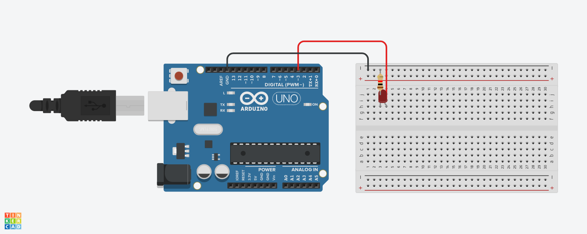

# Arduino LED Brightness
This project uses an Arduino board to control a LED's brightness, gradually increasing it from zero to maximum brightness and then decreasing it back to zero, in a loop. The fade amount for each step is 5, and the code consists of only one if statement.

# Table of Contents
- Requirements
- Installation
- Usage
- Contributing
- License
# Requirements
To run this project, you will need the following:

- An Arduino board (tested on Arduino Uno)
- A 220-ohm resistor
- A breadboard
- A LED
- Jumper wires
- Arduino IDE (or other compatible software)
# Installation
To install this project, follow these steps:

1. Clone the repository to your local machine using Git or download it as a ZIP file.
2. Connect the LED and resistor to the Arduino board according to the wiring diagram provided in the schematic.png file. 
3. Open arduino-led-brightness.ino file in the Arduino IDE.
4. Compile the code and upload it to the Arduino board.
# Usage
To use this project:

1. Connect the Arduino board to a power source.
2. The LED will gradually increase in brightness from zero to maximum brightness, then decrease back to zero, in a loop.
# Tinkercad
- You can view a live simulaton of the project through the following link on [Tinkercad](https://www.tinkercad.com/things/70ZORgZTolk-arduino-led-brightness)
# Contributing
If you'd like to contribute to this project, please follow these steps:

1. Fork the repository.
2. Create a new branch with your changes: git checkout -b my-feature-branch.
3. Commit your changes: git commit -am 'Add some feature'.
4. Push to the branch: git push origin my-feature-branch.
5. Submit a pull request.
# License
This project is licensed under the MIT License ↗. You are free to use, modify, and distribute the code as you see fit.
